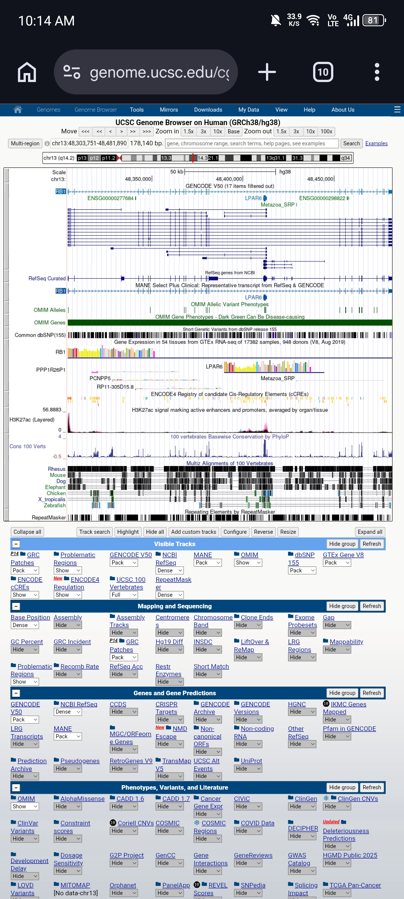

# Exploring RB1 Using UCSC Genome Browser and NCBI ClinVar

**Name:** Gedden D. Estrevillo

**Date:** September 22,2026

**Assigned Gene:** RB1

**Associated Disease:** Retinoblastoma

---

## 1. Assigned Gene and Disease

RB1 (RB transcriptional corepressor 1) is a tumor suppressor gene. It's best known as the gene responsible for retinoblastoma, a childhood eye cancer, but loss-of-function mutations in RB1 are also linked to bladder cancer and osteogenic sarcoma. RB1 normally controls the G1-to-S transition in the cell cycle by repressing E2F1 target genes, so when it's disrupted, cells lose an important brake on division.

---

## 2. UCSC Gene Location

| Field | Value |
|---|---|
| Gene symbol | RB1 |
| Full name | RB transcriptional corepressor 1 |
| Chromosome | 13 (13q14.2) |
| Genome assembly | GRCh38/hg38 |
| Genomic coordinates | chr13:48,303,751–48,481,890 |
| Strand | + |
| Approximate size | ~178 kb |

**Screenshot 1:** 

---

## 3. Exons, Introns, and Transcripts

| Field | Value |
|---|---|
| Transcript used | ENST00000267163.6 (= NM_000321.3) |
| Number of exons | 27 |
| Multiple transcripts visible? | Yes — GENCODE V50 shows several stacked isoforms |

**Exon vs. intron (in my own words):** An exon is a piece of the gene that stays in the final mRNA after splicing and can be translated into protein. An intron is the stretch of sequence between exons that gets cut out during splicing and never makes it into the mature message.

**Intron vs. exon length:** Introns are much longer than exons in RB1. The gene spans about 178 kb, but most of that length is intronic — the 27 exons are relatively short, separated by long connecting introns. This is typical for a large gene like RB1.

**Screenshot 2:** `screenshots/02_gene_structure.png`

---

## 4. UCSC Annotation Tracks

**Gene annotation track used:** GENCODE V50 (cross-checked against NCBI RefSeq)

**Were ClinVar variant marks visible?** Yes. There's dense clustering of variants in specific regions, with several large ClinVar Copy Number Variant bars spanning much of the gene, and tall spikes in the ClinVar SNV histogram at a few "hotspot" exons.

**Was conservation uneven across the gene?** Yes. The PhyloP conservation track had uneven peaks — some spikes were much taller than others, rather than a flat, consistent signal.

**Did conserved regions match exons or introns?** Conservation peaks lined up mainly with exons. The tall spikes occurred where the gene model showed exon boxes, while the flatter, less conserved stretches corresponded to the long intronic regions.

**Why does strong conservation suggest biological importance (2–3 sentences):** Sequence that stays similar across distantly related species (mouse, chicken, zebrafish, etc.) has likely been under selective pressure to stay the same. If a mutation in that region were harmless, it would have accumulated changes randomly over evolutionary time — the fact that it hasn't suggests the sequence does something important, often coding for a critical part of the protein.

**Screenshot 3:** `screenshots/03_tracks.png`

---

## 5. Selected ClinVar Variant

| Field | Value |
|---|---|
| Gene | RB1 |
| Variant name / HGVS | NM_000321.3(RB1):c.103C>T (p.Gln35Ter) |
| Protein change | Q35* (glutamine → premature stop at codon 35) |
| Variation ID | 126818 |
| VCV accession | VCV000126818.11 |
| rsID | rs587778869 |
| Chromosome/position | chr13:48,304,015 (GRCh38) |
| Condition | Retinoblastoma |
| Clinical significance | Pathogenic |
| Review status | 2 stars — criteria provided, multiple submitters, no conflicts (2 of 2 submissions agree) |
| Molecular consequence | Nonsense |
| Record URL | [paste your ClinVar URL here] |

**Screenshot 4:** `screenshots/04_clinvar_variant.png`

---

## 6. Locating the Variant in UCSC

**Where is the variant located relative to RB1?** Within the coding region, near the 5' portion of the gene — c.103 out of roughly 2,787 coding bases, at genomic position chr13:48,304,015.

**Exon, intron, UTR, or splice region?** Exon — specifically the coding portion (shown as a solid/thick box in the UCSC gene track), not UTR or intron. The screenshot shows the variant falling inside a solid exon box, past the nearby intron/exon splice boundary.

**Coding or non-coding?** Coding.

**How might this variant affect the gene or gene product?** c.103C>T changes codon 35 from glutamine to a premature stop codon (p.Gln35Ter). This truncates the RB1 protein at residue 35 out of 928, eliminating essentially the entire functional protein — including the pocket domain required for tumor suppression. This kind of change would likely trigger nonsense-mediated mRNA decay or produce a non-functional truncated protein, either way resulting in loss of RB1 function.

**What additional evidence would be needed to confirm pathogenicity?** Functional/biochemical studies confirming loss of protein function, segregation data showing the variant tracks with disease in affected families, and population frequency data confirming its absence (or rarity) in healthy individuals. That said, ClinVar's 2-star "multiple submitters, no conflicts" status already reflects fairly strong existing clinical evidence.

**Screenshot 5:** `screenshots/05_variant_in_ucsc.png`

---

## 7. Interpretation

Overall, this activity connected a clinically reported RB1 variant (c.103C>T) to its exact position in the genome. The variant sits inside a coding exon near the start of the gene, and it creates an early stop codon that would truncate most of the RB1 protein — consistent with its "Pathogenic" classification in ClinVar and its role in causing retinoblastoma. Comparing the gene structure, conservation track, and ClinVar variant clustering also showed that this part of RB1 is both evolutionarily conserved and a recurring hotspot for pathogenic variants, reinforcing that this coding region is functionally critical.

---

## 8. Reflection

**1. What did UCSC show you about RB1 that wasn't obvious from simply reading about its function?**

Reading about RB1 explains that it's a tumor suppressor regulating the cell cycle, but it doesn't convey scale. Seeing the gene in UCSC showed that RB1 spans roughly 178 kb but is made up of 27 relatively small exons connected by very long introns — most of the gene's physical length is non-coding. It also showed that ClinVar-reported variants aren't spread evenly across the gene; they cluster in dense hotspots at specific exons.

**2. Why is knowing the exact genomic location of a disease-associated variant useful?**

An exact genomic location lets you pinpoint precisely which functional region a variant falls in — coding exon, intron, UTR, or splice site — which determines whether it's likely to disrupt the protein. It also allows different databases (ClinVar, UCSC, dbSNP) to be cross-referenced at the same coordinate, so evidence from multiple sources can be combined to support or question a clinical interpretation.

**3. What is one limitation of predicting a variant's effect only from its genomic location?**

Location alone tells you where a variant sits and can suggest it's likely disruptive, but it doesn't prove pathogenicity. Two variants in the same exon can have very different effects depending on the specific amino acid change, and confirming true clinical significance requires additional evidence like functional studies, segregation data, or population frequency — location is a starting clue, not a conclusion.

**4. What was the most interesting feature you observed about RB1?**

The most interesting feature was how tightly clustered the pathogenic ClinVar variants were in specific exons rather than spread randomly across the gene — visible as tall spikes in the ClinVar SNV track lining up with a few particular exons. This makes sense given RB1's mechanism as a tumor suppressor: loss-of-function variants (nonsense, frameshift) concentrated in critical coding regions are the ones most likely to destroy the protein's pocket domain and disable its tumor-suppressing function.

---

## 9. References and Links

- UCSC Genome Browser: https://genome.ucsc.edu/
- NCBI ClinVar: https://www.ncbi.nlm.nih.gov/clinvar/
- Selected ClinVar record: https://ncbi.nlm.nih.gov/clinvar/variation/126818/ 

---

## Submission

- **Assigned gene:** RB1
- **Selected ClinVar variant:** NM_000321.3(RB1):c.103C>T (p.Gln35Ter)
- **Date completed:** September 22,2026
